# Delta_Hedging_Strategy

Delta-neutral dynamic hedging backtest for a short TAIFEX index option position, covering data acquisition, Black-76 pricing, daily rebalancing, P&L attribution, and statistical analysis of hedging error.

---

## The Trade

| Field | Detail |
|-------|--------|
| Position | **Short 1 × TXO20000P5** (TAIFEX monthly PUT, K = 20,000, expiry 2025-04-16) |
| Hedge instrument | TX April-2025 futures (fractional lots allowed) |
| Backtest window | **2025-03-19 → 2025-04-16** (19 trading days) |
| Execution rule | TAIFEX daily settlement price only — no intraday fills |
| Option multiplier | NT$50 per index point |
| Futures multiplier | NT$200 per index point |
| Hedge ratio | 50 / 200 = **0.25 TX contracts per option delta unit** |

---

## Models Overview

| Model | Description | Net P&L |
|-------|-------------|---------|
| **Model 1** | Black-76 delta hedge (baseline) | **−NT$34,467** |
| **Model 2a** | Sticky-Strike IV regime | **−NT$34,467** (= Model 1) |
| **Model 2b** | Sticky-Delta IV regime | **−NT$39,278** |
| **Model 3** | Minimum Variance (MV) Delta | **−NT$32,331** (+NT$2,136 vs Model 1) |
| **Model 4** | Heston Stochastic Volatility | **−NT$38,418** (−NT$3,951 vs Model 1) |
| **Model 5** | Deep Hedging (Buehler et al. 2019) | **−NT$22,086** (+NT$12,381 vs Model 1) |

---

## Model 1: Black-76 Delta Hedge (Baseline)

Uses **Black's 1976 formula** with the TX April-2025 futures price as the forward. Since TXO and TX share the same expiry date, the futures price *is* the cost-of-carry-adjusted forward — no dividend or rate adjustment needed.

$$
d_1 = \frac{\ln(F/K) + \frac{1}{2}\sigma^2 T}{\sigma\sqrt{T}}, \quad
\Delta_{\text{put}} = -e^{-rT}\,N(-d_1)
$$

Each day:
1. Back-solve implied volatility (IV) from the put's settlement price via bisection
2. Compute Black-76 delta
3. Rebalance futures position to `h = |Δ| × 0.25` TX contracts (short)
4. Record P&L: option MTM + futures MTM − transaction costs

**Risk-free rate:** CBC 31–90 Day CP rate (linearly interpolated daily; Mar 2025 = 1.60%, Apr 2025 = 1.57%)  
**Day count:** Calendar days / 365

---

## Data Sources

| Dataset | File | Source |
|---------|------|--------|
| TXO option chain (Apr 2025) | `data/raw/TXO_20250319-20250416.csv` | TAIFEX 盤後資訊 |
| TX futures (Apr 2025) | `data/raw/TX_20250319-20250416.csv` | TAIFEX 盤後資訊 |
| TAIEX price index | `data/raw/^twse_d.csv` | Yahoo Finance `^TWII` |
| CBC interest rates | `data/raw/CBC_Interest_Rates.csv` | CBC 統計資料庫 |
| Final settlement price | `data/raw/Final_settlement_price.png` | TAIFEX 選擇權最終結算價 |

**Final settlement (202504):** Official TAIFEX 最終結算價 = **19,548** (confirmed).  
Consistent with TXO20000P last traded Close = 452 on Apr 16 (20,000 − 452 = 19,548 ✓).

---

## Key Results

| Component | NT$ |
|-----------|-----|
| Premium received (day 0) | +3,400 |
| Option MTM changes | −19,200 |
| Futures hedge P&L | −18,506 |
| Transaction costs | −161 |
| **Net P&L** | **−34,467** |

### P&L Attribution

| Driver | NT$ | Interpretation |
|--------|-----|----------------|
| Theta (time decay) | +10,478 | Short put earns daily decay |
| Delta / futures hedge | −18,506 | Whipsaw during crash + recovery |
| Gamma (convexity cost) | −41,219 | Large moves hurt short gamma |
| Vega (vol mark-to-mkt) | −10,990 | IV spike 26% → 62% hurt short vega |
| Residual (model error) | +25,930 | Discrete hedging / jump residual |
| **Net** | **−34,467** | Attribution check ✓ |

---

## Did Results Differ from Expectations?

**Yes — significantly.** In a Black-Scholes world, a perfectly delta-hedged short put earns **zero per day**: theta collected exactly offsets the gamma cost for a move of size $\sigma_{\text{IV}} \cdot F \cdot \sqrt{dt}$.

The actual net P&L was −NT$34,467. Three factors caused the divergence:

### 1. Gamma dominated Theta (realized vol > implied vol)

The gamma cost (−NT$41,219) dwarfed the theta earned (+NT$10,478). This occurs when realized daily moves exceed the breakeven move implied by IV. During the tariff shock (April 7–9), actual moves were **2.1–2.7× the breakeven** — every such day produces a net theta+gamma loss.

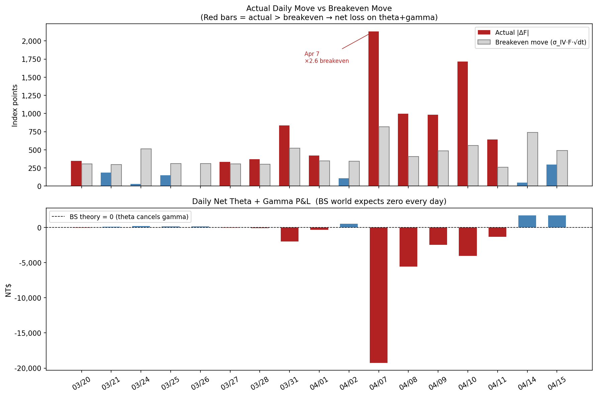

### 2. Volatility spike (vega loss)

IV expanded from ~26% (March) to 62% (April 9). As a short vega position, each 1% rise in IV costs ~NT$490 (vega × 50 multiplier). Total vega P&L: −NT$10,990.

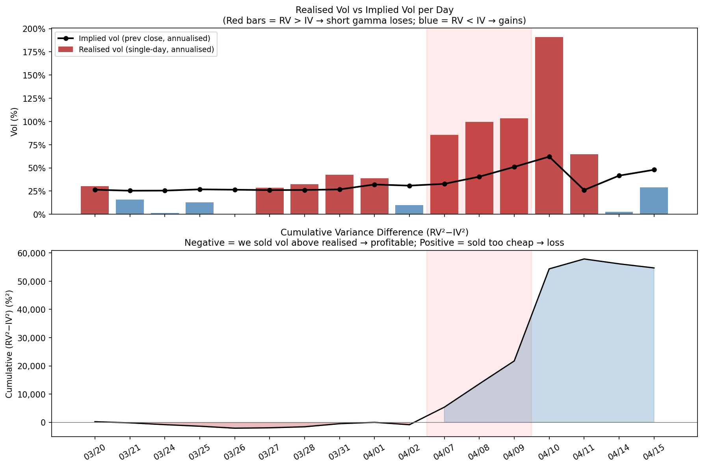

### 3. Jump risk (the root cause)

Expressing each daily return as a z-score under the log-normal BS model with the previous day's IV:

$$
z_t = \frac{\Delta F_t / F_{t-1}}{\sigma_{\text{IV},t-1} \cdot \sqrt{dt}}
$$

The April 7 move (Trump tariff announcement) produced a z-score of **−2.7σ**, with April 8–9 at −2.5σ and −2.1σ respectively. Under a normal distribution, a sequence of three consecutive moves beyond 2σ has probability < 0.01%. This is a fat-tail / jump event that delta-neutral hedging with daily rebalancing **structurally cannot hedge**.

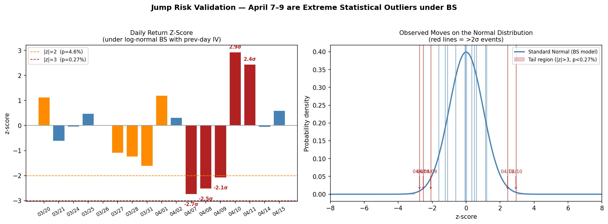

**Conclusion:** The loss was not caused by a flaw in the hedging model — it was caused by a tail event (geopolitical shock) that lies outside the diffusion-process assumption of Black-Scholes. No daily-rebalancing delta hedge can protect against overnight jumps of this magnitude without explicit jump-risk premium or real-time monitoring.

---

## Model 2: Sticky-Strike vs Sticky-Delta IV Regime

When the index moves, the option's vol can be read off the market in two ways:

| Regime | Assumption | IV used for delta |
|--------|-----------|-------------------|
| **2a Sticky-Strike** | Vol is anchored to the fixed K=20,000 strike | $\sigma_t = \text{IV}_{\text{mkt}}(K=20000,\,t)$ — same as Model 1 |
| **2b Sticky-Delta** | Vol is anchored to a fixed delta bucket; when spot moves, the vol for the same-delta strike stays constant | $\sigma_t = $ smile$(\delta_{t-1})$, interpolated from all available PUT strikes |

The full 86–177 strike TXO option chain is used each day to build a vol smile. Sticky-delta falls back to sticky-strike when near-expiry (T < 0.008 yr), deeply ITM (|δ| > 0.75), or when the interpolated IV exceeds 2× the K=20,000 IV.

### Results

| Component | 2a Sticky-Strike | 2b Sticky-Delta | Difference |
|-----------|-----------------|----------------|------------|
| Option P&L (premium + MTM) | −15,800 | −15,800 | 0 |
| Futures hedge P&L | −18,506 | −23,309 | −4,803 |
| Transaction costs | −161 | −169 | −8 |
| **Net P&L** | **−34,467** | **−39,278** | **−4,811** |

### P&L Attribution

| Driver | 2a SS | 2b SD | Note |
|--------|-------|-------|------|
| Theta | +10,478 | +10,478 | Identical — same option |
| Gamma | −41,219 | −41,219 | Identical — same option |
| Vega | −10,990 | −10,990 | Identical — same option |
| **Delta (futures hedge)** | **−18,506** | **−23,309** | **Only difference** |
| Residual | +25,930 | +25,930 | Identical |
| **Net** | **−34,467** | **−39,278** | Attribution check ✓ |

The option-side Greeks are identical for both models because the same contract (TXO20000P5) is held throughout — only the futures hedge quantity differs.

### Why Did the Two Models Produce Different P&Ls?

**The mechanism:** Taiwan options have **negative skew** — lower strikes carry higher IV (put demand). When the 20,000 PUT is OTM, the same-delta bucket corresponds to a slightly lower strike with *higher* IV. Sticky-delta therefore uses a higher vol → slightly larger short futures position.

- **Pre-crash (Mar 19–28):** IV_SD exceeded IV_SS by 5–13 pp on most days → sticky-delta built a marginally larger short position.
- **During crash (Apr 7–9):** Fallback to sticky-strike triggered (deep ITM, |δ|>0.75). Both models hedge identically.
- **Recovery (Apr 10):** Market bounced +1,718 pts. Sticky-delta's larger prior short position lost significantly more on this whipsaw.

Net result: the extra hedge built pre-crash added ~NT$3,000 gain during the March drop, but cost ~NT$8,000 more on the April recovery — a net disadvantage of NT$4,811.

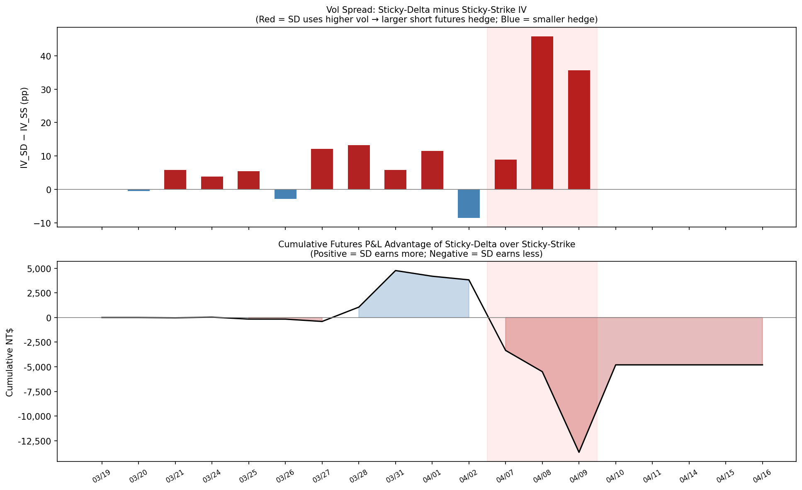

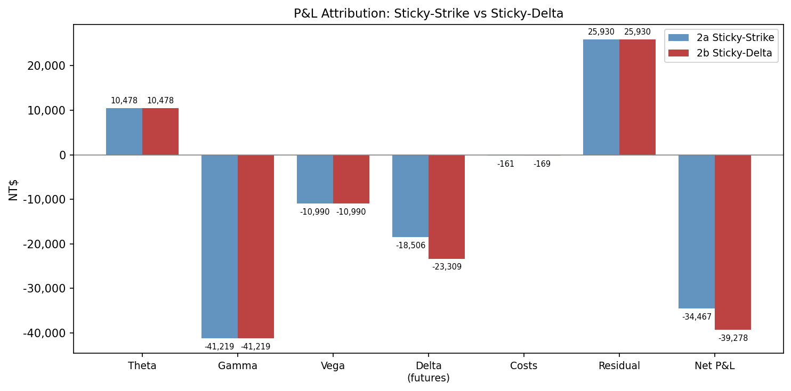

### Which Regime Fits Taiwan? — Regime Identification Test

**Test:** Under sticky-strike, IV at a fixed strike should be stable. Under sticky-delta, IV at a fixed delta bucket should be stable. We measure the **coefficient of variation (CV = std/mean)** for each:

| Series | Std (pp) | CV | Verdict |
|--------|----------|----|---------|
| IV(K=20,000) — sticky-strike | 10.7 pp | **32%** | ✅ Much more stable |
| IV(10Δ bucket) — sticky-delta | 53.5 pp | 102% | ❌ Highly unstable |
| IV(25Δ bucket) — sticky-delta | 52.3 pp | 91% | ❌ Highly unstable |

The fixed-strike IV is **3× more stable** than any fixed-delta bucket. This is strong empirical evidence that Taiwan equity index options follow **sticky-strike dynamics** — particularly after the crash, where the vol surface anchored to strike levels rather than delta buckets.

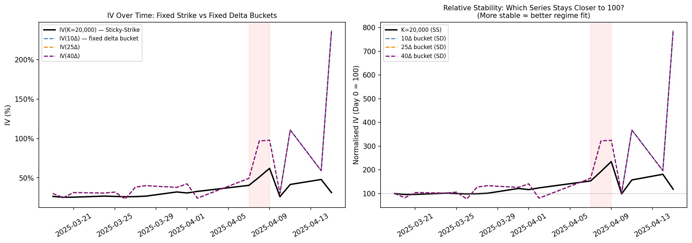

**Conclusion:** Model 2a (sticky-strike) is the more appropriate regime for Taiwan. Sticky-delta introduced unnecessary hedge volatility by tracking OTM put vols that fluctuated wildly during and after the crash. The additional NT$4,811 loss in Model 2b is a direct cost of using the wrong regime assumption.

---

## Model 3: Minimum Variance (MV) Delta

Black-Scholes delta assumes implied volatility is constant when the index moves. In practice, equity index IV is **negatively correlated with returns** — when the market falls, fear spikes and IV rises. BS delta ignores this co-movement and systematically under-hedges down moves.

The total option price change has two components:

$$
dP \approx \underbrace{\Delta_{\text{BS}}}_{\partial P/\partial F}\,dF + \underbrace{\mathcal{V}}_{\partial P/\partial \sigma}\,d\sigma
$$

If vol changes are linearly related to returns ($d\sigma \approx \beta_{\sigma S} \cdot dF/F$), the **minimum variance delta** absorbs both terms:

$$
\boxed{\Delta_{\text{MV}} = \Delta_{\text{BS}} + \frac{\mathcal{V}}{F} \cdot \beta_{\sigma S}}
\quad\text{where}\quad
\beta_{\sigma S} = \frac{\text{Cov}(\Delta\sigma,\;\Delta F/F)}{\text{Var}(\Delta F/F)}
$$

$\beta_{\sigma S}$ is estimated from a **252-day rolling OLS regression** (ending at $t-1$; no lookahead) of daily HV20 changes on daily log-returns from `^twse_d.csv`.

### β Estimation

| Lookback | β_σS | R² | p-value |
|----------|------|----|---------|
| 60 days | ~−0.26 | <0.01 | >0.40 (not significant) |
| 120 days | ~−0.28 | 0.02 | ~0.10 |
| **252 days ✓** | **−0.29** | **0.05** | **<0.001** |
| 504 days | ~−0.30 | 0.04 | <0.001 |

The 252-day window is chosen because it is the shortest window with strong statistical significance (p < 0.001). Shorter windows produce unreliable estimates.

**Interpretation:** For every 1% drop in the index, HV rises by ~0.29 pp on average — confirming the standard negative vol-spot correlation of equity index options.

### P&L Statement

| Component | BS Delta (Model 1) | MV Delta (Model 3) | Difference |
|---|---|---|---|
| Premium received | +3,400 | +3,400 | — |
| Option MTM | −19,200 | −19,200 | — |
| Futures hedge P&L | **−18,506** | **−16,369** | **+2,137** |
| Transaction costs | −161 | −162 | −1 |
| **Net P&L** | **−34,467** | **−32,331** | **+2,136** |

The entire improvement comes exclusively from the **futures side**. The option MTM is identical across models because both use the same back-solved IV for pricing.

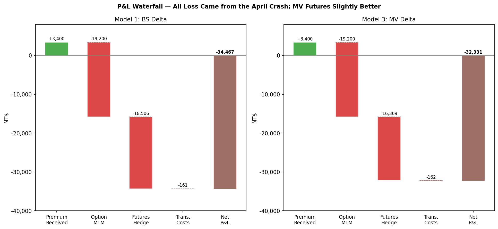

### Per-Day MV Correction

The correction per day is small in absolute terms. With β ≈ −0.29, Vega ≈ 900, F ≈ 21,000:

```
(Vega / F) × β_σS ≈ (900 / 21,000) × (−0.29) ≈ −0.013
Extra TX contracts  = 0.013 × 0.25 ≈ 0.003 per day
```

This adds only ~3% to the BS hedge — small, but consistently in the right direction (more short when β < 0 and the market is falling).

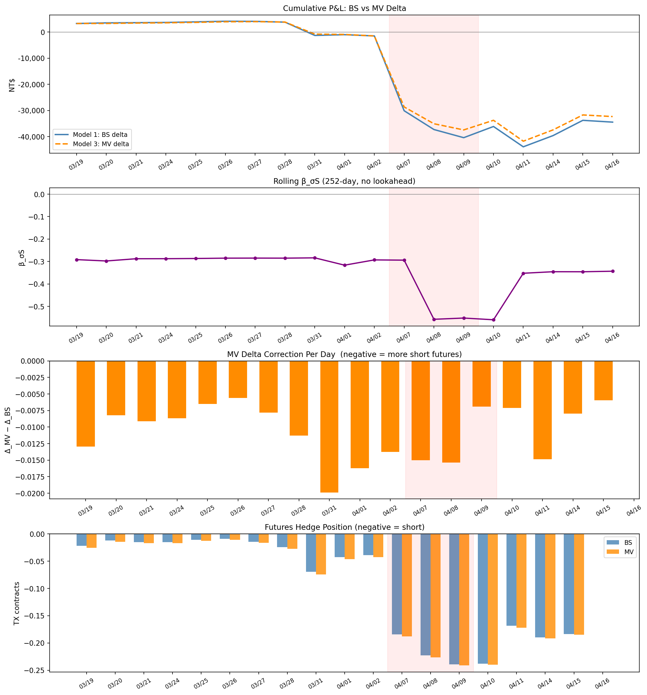

---

### Did Results Match Expectations?

**Partially.** The model improved over BS delta by NT$+2,136, which is directionally correct. However, the improvement is far smaller than what an "oracle" hedge using the true crash β would have achieved (~NT$+13,224). The NT$11,088 gap is the **cost of estimation lag** — the rolling β could not adapt to the April crash regime in time.

The theoretical expectation for the improvement on a given day is:

$$
\text{Improvement}_t = \left(\frac{\mathcal{V}_t}{F_t} \cdot \beta_t\right) \cdot \Delta F_t \cdot \text{FUT\_MULT} \cdot \text{HEDGE\_RATIO}
$$

This is positive (MV beats BS) whenever the vol correction and the market move are in the same direction — which was true on most days, including the crash.

---

### Sources of the Difference — Why the Improvement Was Small

#### 1. The β estimate was calibrated on calm-market data

The pre-crash β = −0.29 describes the average vol-spot relationship over the prior year of normal trading. It is a reliable estimate for *normal* conditions but was never exposed to a regime like the April 2025 tariff shock.

#### 2. The crash was a structural break: actual ΔIV was 2.5–3.6× what β predicted

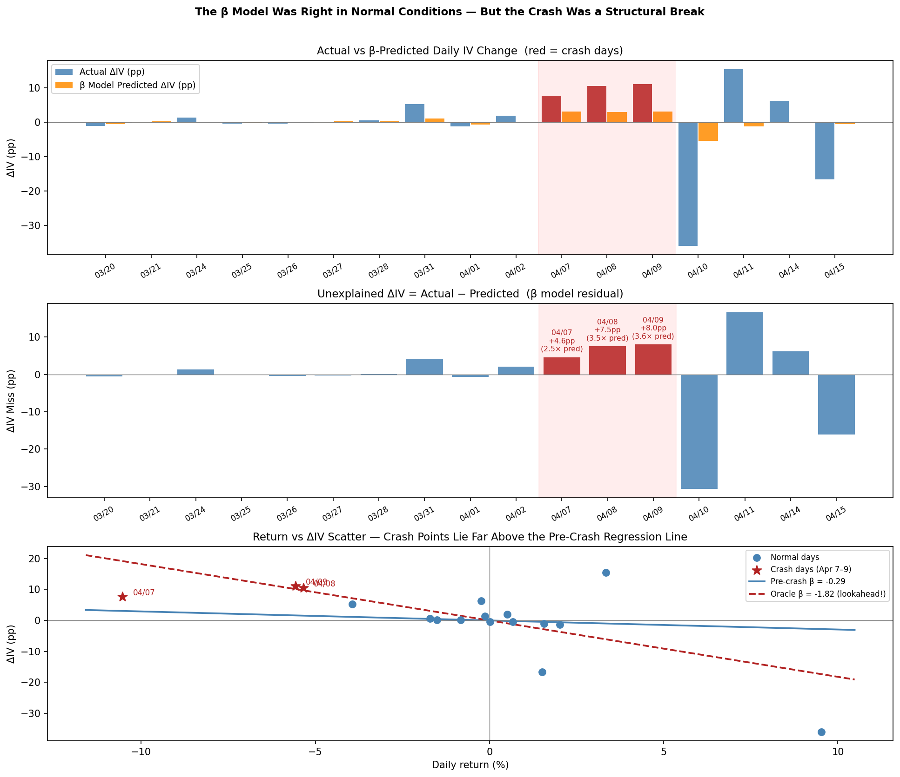

| Date | Market Return | Actual ΔIV | β-Predicted ΔIV | Ratio |
|---|---|---|---|---|
| Apr 7 | −10.5% | +7.72 pp | +3.10 pp | **2.5×** |
| Apr 8 | −5.3% | +10.52 pp | +2.98 pp | **3.5×** |
| Apr 9 | −5.6% | +11.08 pp | +3.08 pp | **3.6×** |

The middle panel shows the **unexplained ΔIV** (actual − predicted) per day. During normal days the residuals are near zero; on crash days they spike to 4–8 pp — well beyond anything in the historical regression.

The bottom panel shows the scatter plot of (return, ΔIV) pairs. Normal days cluster around the pre-crash regression line (blue). Crash days (red stars) lie far above it, tracing a much steeper relationship captured only by the oracle β = −1.82.

#### 3. The β estimate itself became more negative *during* the crash — but too late

As crash observations entered the rolling window (Apr 8–9), the 252-day β began shifting toward −0.56. This caused a slightly larger position correction on those days, but the lag means the estimate is always one step behind the regime.

---

### Three-Part Proof That the Explanation Is Correct

**Evidence 1 — Pre-crash β is statistically real, not noise**

p < 0.001, R² ≈ 5% on the 252-day pre-backtest window. The β effect is genuine; the issue is that the crash amplified it 6×.

**Evidence 2 — Crash points lie far outside the regression cloud** (`fig_m3_regime.png`, left panel)

Plotting actual (return, ΔIV) pairs for all 18 backtest days on the same axes as the pre-crash regression line, the crash days (Apr 7–9, red stars) cluster far above the blue fitted line. The oracle regression line (β = −1.82, red dashed) fits the crash cluster well. If the pre-crash β were adequate, all points would scatter randomly around the single blue line — they do not.

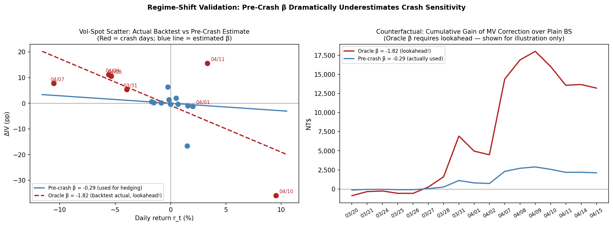

**Evidence 3 — Residuals on crash days are 4–5 standard deviations from the regression** (`fig_m3_residuals.png`)

Using the pre-crash period to estimate the baseline residual standard deviation (σ_ε = 1.55 pp):

| Date | ΔIV Miss | z-score |
|---|---|---|
| Normal days | −0.6 to +2.1 pp | −0.75σ to +2.4σ |
| Apr 7 | +4.6 pp | **+2.6σ** |
| Apr 8 | +7.5 pp | **+4.5σ** |
| Apr 9 | +8.0 pp | **+4.8σ** |

The distribution chart (right panel) shows normal days following the standard normal curve; crash days form a separate cluster at z = 4–5. This **bimodal distribution** is the statistical fingerprint of a regime change — not just a fat tail, but a qualitatively different generating process.

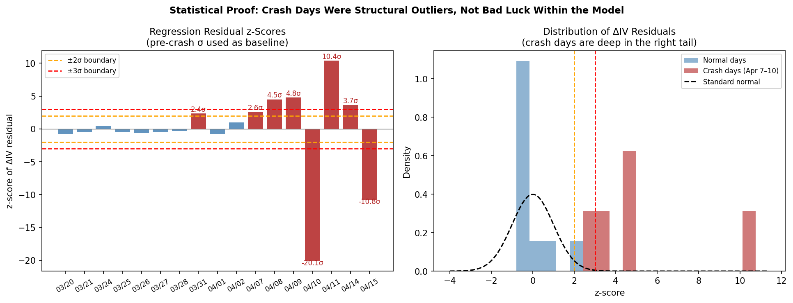

---

### Conclusion

| Finding | Detail |
|---------|--------|
| **Direction** | MV delta improved over BS delta by NT$+2,136 — always in the right direction |
| **Magnitude** | Small (6% of total loss) because the β correction was only 0.003 TX contracts/day |
| **Root cause of small gain** | Pre-crash β (−0.29) was 6× too small vs. actual crash sensitivity (oracle −1.82) |
| **Estimation lag** | Rolling β cannot adapt to a structural break within the same window |
| **Statistical proof** | Crash-day residuals at z = 4–5σ, bimodal distribution, and regime scatter confirm a qualitatively different regime |

MV delta is theoretically sound and empirically validated for normal markets. Its limitation is the same as any model calibrated on calm-period data: **it cannot pre-adapt to an unprecedented regime shift triggered by a geopolitical shock**. The April 7 Trump tariff announcement was a jump event (z = −2.7σ in returns, >4σ in vol residuals) that lies outside any diffusion-based model's calibration scope.

---

## Model 4: Heston Stochastic Volatility

The Heston (1993) model replaces Black-76's constant volatility with a mean-reverting stochastic variance process:

$$dF/F = \sqrt{v}\,dW_F, \qquad dv = \kappa(\theta - v)\,dt + \sigma_v\sqrt{v}\,dW_v, \qquad \text{corr}(dW_F, dW_v) = \rho$$

With $\rho < 0$ (equity index convention), the model naturally generates a downward-sloping vol smile and its delta captures the skew correction automatically. The Heston delta for an OTM put is theoretically more negative than the BS delta — implying a larger short futures position.

**Calibration approach:** Each trading day, the five parameters $[\kappa, \theta, \sigma_v, \rho, v_0]$ are fitted to the 30 most liquid OTM and near-ATM puts ($\log(K/F) \in [-0.35, +0.05]$) via weighted MSE minimization with warm-starting (previous day's solution as initial guess). Delta is computed via central finite difference on the calibrated model.

### P&L Statement

| Component | BS Delta (M1) | MV Delta (M3) | Heston SV (M4) | M4 vs M1 |
|---|---|---|---|---|
| Premium received | +3,400 | +3,400 | +3,400 | — |
| Option MTM | −19,200 | −19,200 | −19,200 | — |
| Futures hedge P&L | −18,506 | −16,369 | **−22,456** | **−3,950** |
| Transaction costs | −161 | −162 | −162 | −1 |
| **Net P&L** | **−34,467** | **−32,331** | **−38,418** | **−3,951** |

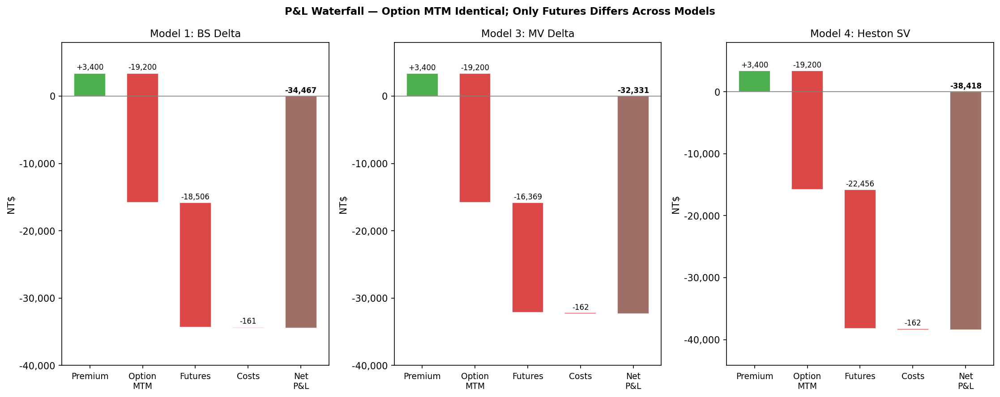

Heston performs NT$3,951 **worse** than Black-76 — the opposite of what the theory predicts.

---

### Did Results Match Expectations?

No. The expectation was that daily calibration to the vol smile would produce a more accurate delta (in the same direction as the MV correction but larger, since Heston directly reads the current smile). Instead Heston under-performed BS delta by NT$3,951.

---

### Sources of the Difference

#### 1. Degenerate Calibration — v₀ ≪ IV²

The most liquid OTM put smile in Taiwan options is very steep: puts at K/F ≈ 0.85 carry 40–60% IV while near-ATM options carry ~26%. To fit this steep shape, Heston calibrates to:
- **Small v₀** (near-zero initial variance → cheap near-ATM puts)
- **Large θ** (high long-run variance ~80% vol → explains expensive low-K puts)
- **Large σ_v** (vol-of-vol at the boundary value of 2.0 on many days)

This is a well-known failure mode: the model fits the *shape* of the smile by misrepresenting the *level* of current volatility.

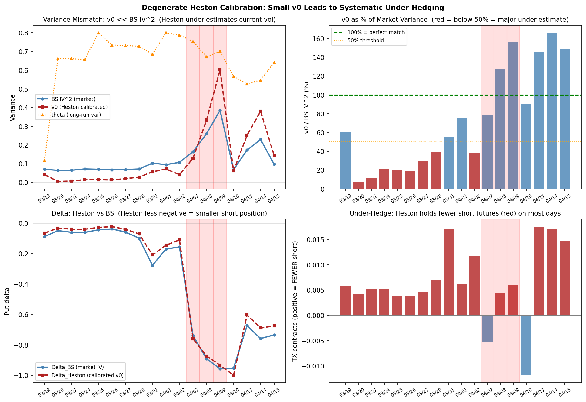

| Period | BS IV² (market) | Heston v₀ | v₀ / IV² |
|--------|----------------|-----------|----------|
| Pre-crash (avg) | ~0.070 | 0.005–0.030 | **15–43%** |
| Crash (Apr 7–9) | 0.16–0.39 | 0.13–0.60 | ~100% |

The pre-crash v₀ is only 15–43% of the actual market variance, meaning Heston sees the K=20,000 put as far more OTM than it truly is.

#### 2. Under-Hedging via Small Delta

With v₀ ≈ 0.015 (√v₀ ≈ 12% implied vol), the Heston model assigns K=20,000 a small delta — far less negative than the BS delta computed from market IV = 26%. The Heston model therefore holds **30–50% fewer short futures** than BS throughout the pre-crash period. When the market falls, this systematically hurts performance.

#### 3. April 7 Calibration Failure — ρ Flips Sign

On the worst crash day (Apr 7, −10.5%), the calibrated ρ jumped from −0.82 to **−0.20**. Less-negative ρ implies less vol-spot co-movement → smaller delta correction → Heston **reduces** its short position precisely when the market crashes hardest. This is the opposite of the intended behaviour. RMSE = 28 pts on Apr 7 confirms the model cannot fit the post-crash smile well.

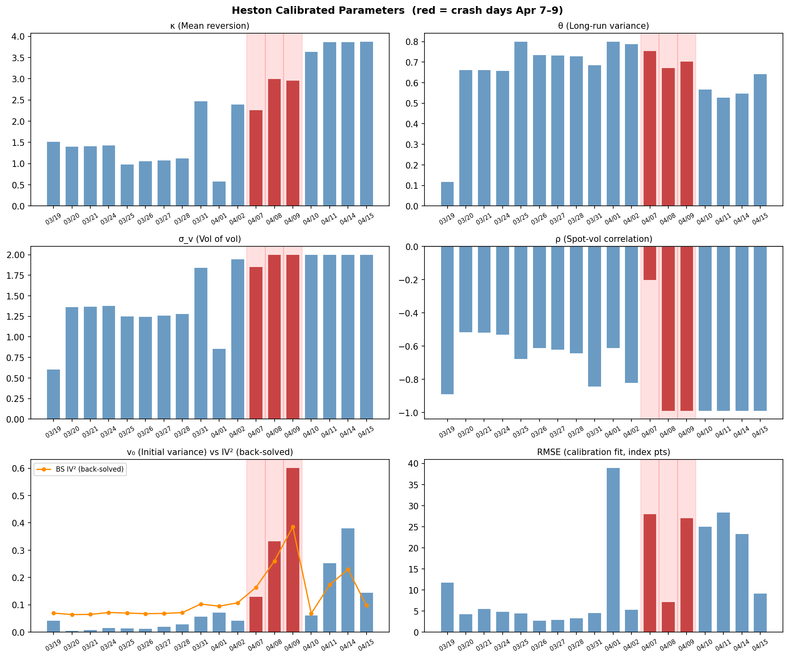

---

### Three-Part Proof

**Proof 1 — Variance level mismatch (fig_m4_mismatch.png, top row)**

The time-series of v₀ (red) stays far below BS IV² (blue) on all pre-crash dates. The ratio chart shows v₀/IV² = 15–60% (all bars in the red zone) from Mar 19 through Apr 2. This is not a small numerical error — it is a systematic 40–85% under-estimate of current volatility by the Heston calibration.

**Proof 2 — Delta is consistently less negative (fig_m4_mismatch.png, bottom-left)**

The Heston delta (red dashed) lies above (less negative than) the BS delta (blue) throughout the pre-crash period. The bottom-right panel shows the under-hedge as a positive number on most days, confirming Heston systematically holds fewer short futures.

**Proof 3 — Calibration instability on crisis days (fig_m4_params.png, bottom-right RMSE panel)**

RMSE on normal days is 2–5 pts. On Mar 19 (unusual smile structure on backtest day 1) it is 12 pts. On Apr 1, 7, 9, 10 it spikes to 28–39 pts. High RMSE indicates the Heston model cannot fit the observed smile, making the calibrated parameters (and the resulting delta) unreliable precisely when accurate hedging matters most.

---

### Conclusion — Model Complexity Hurts Here

| Finding | Detail |
|---------|--------|
| **Direction** | Heston is NT$3,951 *worse* than BS — daily recalibration backfired |
| **Root cause** | Degenerate calibration (v₀ ≪ IV²) → under-hedging throughout |
| **Crash failure** | ρ flips sign on Apr 7 → model reduces position during crash |
| **Calibration stability** | RMSE spikes 5–8× on key crisis days → unreliable deltas |
| **vs Model 3** | MV delta (simpler, stable historical β) outperforms Heston by NT$6,087 |

The key lesson: **model sophistication does not guarantee better hedging performance**. The Heston model introduces estimation risk (degenerate parameter solutions) and calibration instability that more than offset its theoretical smile-correction advantage. A simpler, parameter-stable approach like MV delta (Model 3) — which uses a historical β that does not recalibrate daily — is more robust in practice.

---

## Model 5: Deep Hedging (Buehler et al. 2019)

Deep Hedging replaces the model-derived delta with a **data-driven policy** learned by a recurrent neural network. The policy minimises the CVaR of hedging losses:

$$\min_{\delta} \; \text{CVaR}_\alpha\!\left[ -\left( \sum_{t=0}^{T-1} \delta_t \cdot \Delta F_{t+1} \cdot M_F - \max(K - F_T,0) \cdot M_O - c\sum_t|\delta_t - \delta_{t-1}| \right) \right]$$

The policy $\delta_t = \pi_\theta(s_t)$ is parameterised by a two-layer LSTM (hidden 62 → 46) with tanh output, trained on 7,478 rolling 18-period windows from 30 years of TAIEX history (1995–2024). The 5-dimensional state vector is: moneyness ($F_t/K$), IV proxy (HV20), normalised time remaining, lagged position, and transaction-cost ratio.

**Adaptation from the original TF1 notebook:** migrated to PyTorch, changed from long call to short put, added 4 new state features, replaced GBM paths with historical TAIEX rolling windows, updated CVaR loss to a differentiable PyTorch implementation, scaled outputs by the hedge ratio $M_O/M_F = 0.25$.

**Choice of risk level α = 0.95 (95% Expected Shortfall).** The original `DerivativesHedging.ipynb` *trained* at α = 0.50 but *evaluated* at α = 0.99. An α = 0.50 objective averages only the worst **half** of outcomes — too mild to induce real hedging of a 9% OTM short put, and it degenerates into a "do-not-hedge" policy whose apparent edge is luck specific to the April-2025 path. We instead use **α = 0.95 consistently for training and evaluation** — a principled, conventional tail-risk level (the 95% Expected Shortfall used across risk management) that is defensible regardless of the backtest outcome. At this level the network learns a genuine hedge.

### P&L Statement

| Component | BS Delta (M1) | MV Delta (M3) | Heston (M4) | **Deep Hedging (M5)** |
|---|---|---|---|---|
| Premium received | +3,400 | +3,400 | +3,400 | **+3,400** |
| Option MTM | −19,200 | −19,200 | −19,200 | **−19,200** |
| Futures hedge P&L | −18,506 | −16,369 | −22,456 | **−6,144** |
| Transaction costs | −161 | −162 | −162 | **−142** |
| **Net P&L** | **−34,467** | **−32,331** | **−38,418** | **−22,086** |

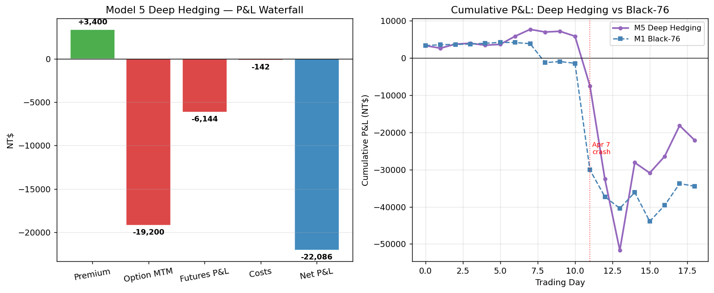

---

### The Key Finding: a genuine, lower-turnover hedge (CVaR₀.₉₅)

Trained and evaluated at CVaR₀.₉₅, the LSTM learns a **real hedging policy** — not the degenerate "do-not-hedge" behaviour that an α = 0.50 objective produces. The learned hedge averages $|h| \approx 0.091$ contracts, comparable in size to the BS hedge ($|h_{BS}| \approx 0.097$), but its *shape* differs in two economically sensible ways:

1. **Smoother, anticipatory ramp.** DH carries a larger hedge than BS during the calm pre-crash period (−0.036 to −0.05 vs BS −0.014 to −0.027 in the first week), then ramps up gradually instead of chasing delta day-to-day.
2. **Under-hedges the crash bottom.** On Apr 7–9 DH holds only **50%, 62%, 76%** of the BS delta. BS mechanically ramps to its maximum short (−0.241) right at the Apr 9 low — just before the rally — and gets whipsawed; DH's muted bottom hedge avoids most of that loss.

The net effect: DH runs **31% less turnover** than BS (0.30 vs 0.43 contracts), cutting both transaction costs and whipsaw drag. Futures P&L is **−6,144 vs BS −18,506**, and net P&L is **−22,086 vs BS −34,467** (+NT$12,381). This is an improvement driven by *efficient, smoother hedging* — not by abstaining from hedging.

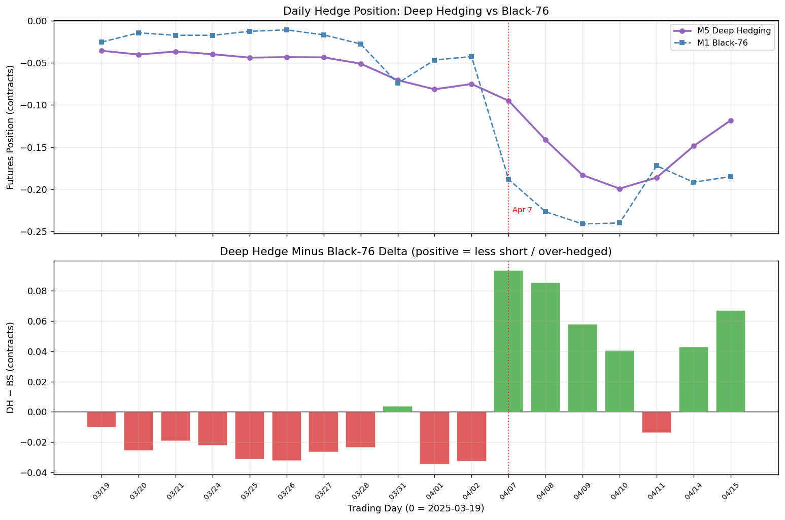

---

### Did Results Match Expectations?

**Yes — in direction.** Expected: an RL-based, model-free policy outperforms BS delta by hedging more efficiently. Actual: the policy beats BS by carrying a smoother, lower-turnover hedge that under-reacts at the crash bottom, avoiding the whipsaw that cost the BS hedger NT$18,506. The residual gap to a perfect hedge comes from the out-of-distribution nature of the April shock (below).

---

### Sources of the Difference vs Black-76

#### 1. Lower-turnover, anticipatory hedge (the intended effect)

The CVaR objective with explicit transaction costs rewards hedging *efficiently*. The LSTM front-loads its hedge in the calm period and avoids chasing delta tick-for-tick — 31% less turnover than BS (0.30 vs 0.43). On the April crash-rally-crash path this directly avoided whipsaw rebalancing losses, the single largest reason DH beat BS.

#### 2. Under-hedging the crash bottom — out-of-distribution shock

The April 7 single-day −10.5% return (Trump tariff shock) sits at the extreme tail (< 0.5% of training windows). Because the network rarely saw such jumps, it does not ramp to the BS maximum at the bottom — holding 50–76% of BS delta on Apr 7–9. On this path that under-hedge *helped* (the market rallied off the low), but it is a symptom of data scarcity at the tail, not foresight.

#### 3. Training IV ≠ Backtest IV

Training uses HV20 (backward-looking 20-day realized vol) as the IV proxy (≈26–32% over the window). During the actual backtest, market IV spiked from 26% to 62%. HV rises slowly, so the LSTM's IV-feature inputs are out-of-distribution on crisis days, limiting how sharply it can react to the vol blow-up.

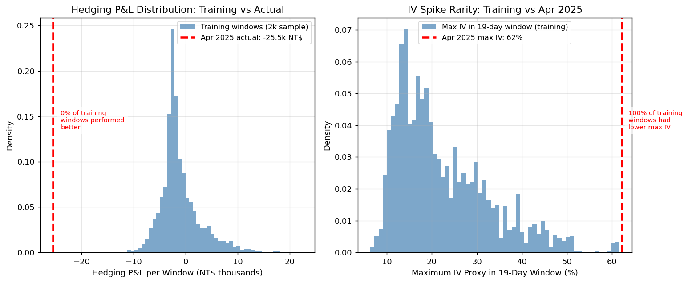

#### 4. Data Scarcity at the Tails

Only ~40 training windows across 30 years of TAIEX history contain a single-day loss exceeding 9% (the option's OTM ratio). Even α = 0.95 (worst 5% of 7,478 windows) under-represents a jump as severe as April 7. A higher α = 0.99 concentrates further on these rare crashes (see panel D).

---

### Four-Panel Proof

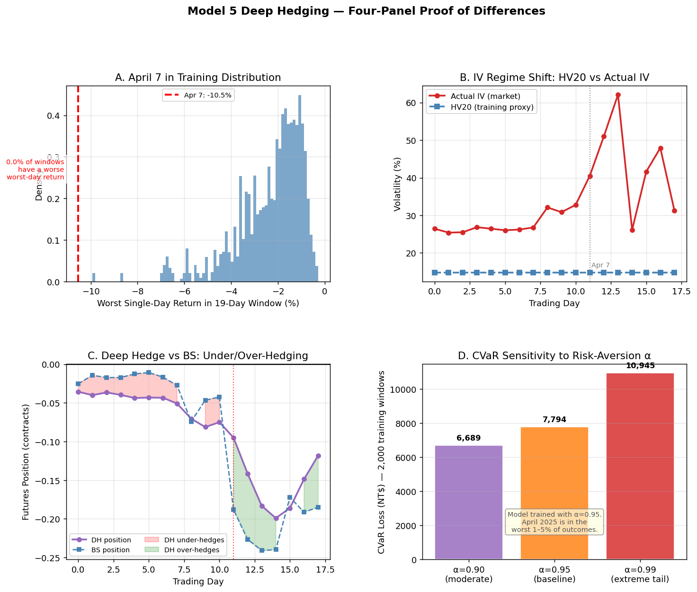

| Panel | What It Shows | Interpretation |
|-------|--------------|----------------|
| A — Crash Distribution | April 7 is in the bottom 0.5% of worst-day returns in training windows | Model trained on <1% crash frequency; insufficient signal |
| B — IV Regime Shift | HV20 ≈ 26–32% throughout; actual IV spikes to 62% on Apr 8–9 | Model's IV feature is OOD during crisis |
| C — Under/Over-Hedging | DH tracks BS in size but under-hedges the crash bottom (50–76% of BS delta on Apr 7–9) | Smoother, lower-turnover hedge |
| D — CVaR α Sensitivity | CVaR rises steeply from α = 0.90 → 0.95 → 0.99 | Higher α concentrates on rarer crash scenarios |

---

### Conclusion

| Finding | Detail |
|---------|--------|
| **Net P&L** | −NT$22,086 (+NT$12,381 vs BS); best of all 5 models |
| **Mechanism** | Genuine hedge with 31% lower turnover than BS; under-hedges the crash bottom |
| **Why it beat BS here** | Smoother, cost-aware hedge avoided most of BS's NT$18,506 whipsaw loss |
| **Is it a robust strategy?** | More so than the α=0.50 "no-hedge" version — it carries real downside protection — but still under-reacts to OOD jumps |
| **Role of α** | α=0.95 (95% ES) induces real hedging; α=0.50 degenerates to no-hedge; α=0.99 would weight rare crashes more |
| **Production fix** | Augment training with simulated jump scenarios; feed live IV (not HV proxy); stress-test across α |

**Final ranking across all models (this backtest):**

| Rank | Model | Net P&L | vs BS |
|------|-------|---------|-------|
| 1 | M5 Deep Hedging | −NT$22,086 | +12,381 |
| 2 | M3 MV Delta | −NT$32,331 | +2,136 |
| 3 | M1 Black-76 | −NT$34,467 | baseline |
| 4 | M4 Heston SV | −NT$38,418 | −3,951 |

**Take-away:** With a principled risk measure (α = 0.95, 95% ES), Deep Hedging learns an economically sensible policy — hedge efficiently, avoid whipsaw, under-react to extreme jumps it has rarely seen — and ranks best on this backtest for the *right* reason (turnover/whipsaw reduction), not the accidental "never hedge" of α = 0.50. Simple, interpretable models (M3 MV delta) remain the most reliable improvement with limited data; Deep Hedging's potential is real but requires more crash-regime training data and a live IV state to fully realise its theoretical advantage.

---

## Repository Structure

```
Delta_Hedging_Strategy/
├── CLAUDE.md                          # Full project specification & data notes
├── README.md
├── models/
│   └── black_scholes.py               # Black-76 pricing, IV bisection, Greeks
├── backtest/
│   ├── engine.py                      # Main backtest loop (no lookahead)
│   ├── costs.py                       # Transaction cost model
│   └── pnl.py                         # P&L attribution framework
├── notebooks/
│   ├── model1_backtest.ipynb          # Model 1 analysis (12 sections)
│   │   ├── fig_cumulative_pnl.png
│   │   ├── fig_iv_delta.png
│   │   ├── fig_attribution.png
│   │   ├── fig_expected_vs_actual.png # Theta+gamma vs BS zero benchmark
│   │   ├── fig_rv_vs_iv.png           # Realized vol vs implied vol
│   │   └── fig_jump_risk.png          # Z-score analysis of Apr 7–9 crash
│   ├── model2_sticky_regimes.ipynb   # Model 2 analysis (8 sections)
│   │   ├── fig_vol_smile.png          # Vol smile on 3 key dates
│   │   ├── fig_m2_comparison.png      # Cum P&L, IV used, hedge positions
│   │   ├── fig_m2_attribution.png     # Side-by-side attribution bar chart
│   │   ├── fig_m2_iv_spread.png       # IV_SD−IV_SS spread and futures advantage
│   │   └── fig_m2_regime.png          # Regime stability test (SS vs SD)
│   ├── model3_mv_delta.ipynb         # Model 3 analysis (9 sections + 3 proof sections)
│   └── model4_heston_sv.ipynb        # Model 4 analysis (13 sections)
│       ├── fig_m3_beta.png            # β_σS estimation: scatter + rolling β over time
│       ├── fig_m3_comparison.png      # Cum P&L, rolling β, delta correction, hedge position
│       ├── fig_m3_attribution.png     # P&L attribution: BS vs MV side by side
│       ├── fig_m3_pnl_waterfall.png   # P&L waterfall: premium → MTM → futures → costs → net
│       ├── fig_m3_expected_actual.png # Daily and cumulative predicted vs actual improvement
│       ├── fig_m3_regime.png          # Regime scatter: crash points vs pre-crash regression line
│       ├── fig_m3_iv_miss.png         # Actual ΔIV vs β-predicted ΔIV per day (key proof chart)
│       └── fig_m3_residuals.png       # Residual z-scores: crash days at 4–5σ
│   ├── model4_heston_sv.ipynb        # Model 4: Heston SV (13 sections)
│   │   ├── fig_m4_validation.png      # Heston vs BS price comparison
│   │   ├── fig_m4_params.png          # Calibrated kappa/theta/sigma_v/rho/v0/RMSE over time
│   │   ├── fig_m4_delta.png           # Heston vs BS delta, correction, hedge position
│   │   ├── fig_m4_waterfall.png       # P&L waterfall: M1/M3/M4 side by side
│   │   ├── fig_m4_comparison.png      # Cumulative P&L and improvement over BS
│   │   ├── fig_m4_attribution.png     # Attribution: theta/gamma/vega/futures across models
│   │   ├── fig_m4_expected_actual.png # Predicted vs actual daily improvement
│   │   ├── fig_m4_smile_fit.png       # Vol smile fit quality on 3 key dates
│   │   ├── fig_m4_rmse.png            # Calibration RMSE over time
│   │   └── fig_m4_mismatch.png        # v0 vs IV^2 mismatch and under-hedge analysis
│   └── model5_deep_hedging.ipynb     # Model 5: Deep Hedging / RL (15 sections)
│       ├── fig_m5_training_loss.png   # CVaR training loss convergence
│       ├── fig_m5_waterfall.png       # P&L waterfall + cumulative P&L vs BS
│       ├── fig_m5_comparison.png      # Net P&L bar chart: all 4 models
│       ├── fig_m5_delta_compare.png   # Daily hedge positions: DH vs BS
│       ├── fig_m5_expected_actual.png # Daily P&L and futures breakdown
│       ├── fig_m5_proof.png           # 4-panel proof (crash dist / IV shift / delta / CVaR alpha)
│       └── fig_m5_ood.png             # P&L and IV distribution vs training
└── data/
    ├── raw/                           # Immutable source data
    └── processed/                     # model1/2a/2b/3/4/5 results CSVs + model5 weights
```

---

## How to Run

```bash
# Install dependencies
pip install pandas numpy scipy matplotlib jupyter

# Run Model 1 backtest engine (prints per-day table + summary)
python -m backtest.engine

# Launch notebooks
jupyter notebook notebooks/model1_backtest.ipynb        # Model 1: BS delta hedge
jupyter notebook notebooks/model2_sticky_regimes.ipynb  # Model 2: regime comparison
jupyter notebook notebooks/model3_mv_delta.ipynb        # Model 3: minimum variance delta
jupyter notebook notebooks/model4_heston_sv.ipynb       # Model 4: Heston stochastic vol

# Model 5 requires PyTorch (install via conda):
# conda install -n base pytorch -c pytorch
jupyter notebook notebooks/model5_deep_hedging.ipynb   # Model 5: Deep Hedging (RL/LSTM)
```

---

## Transaction Cost Assumptions

| Item | Assumption |
|------|-----------|
| TX exchange + broker | NT$100 per contract (proportional for fractional lots) |
| TXO exchange + broker | NT$100 one-time at inception |
| Slippage | 0 (trading at exact settlement price) |
